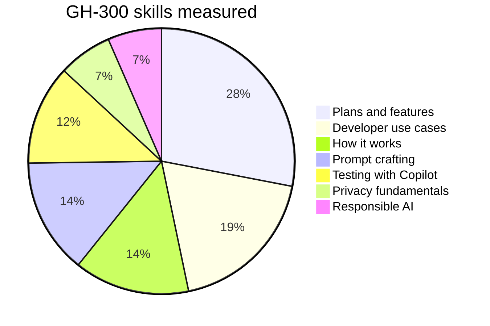
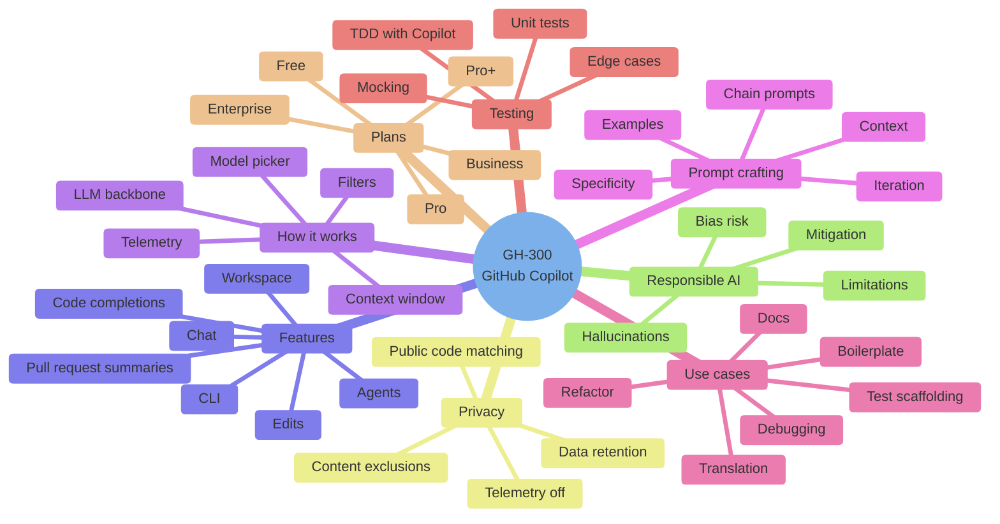
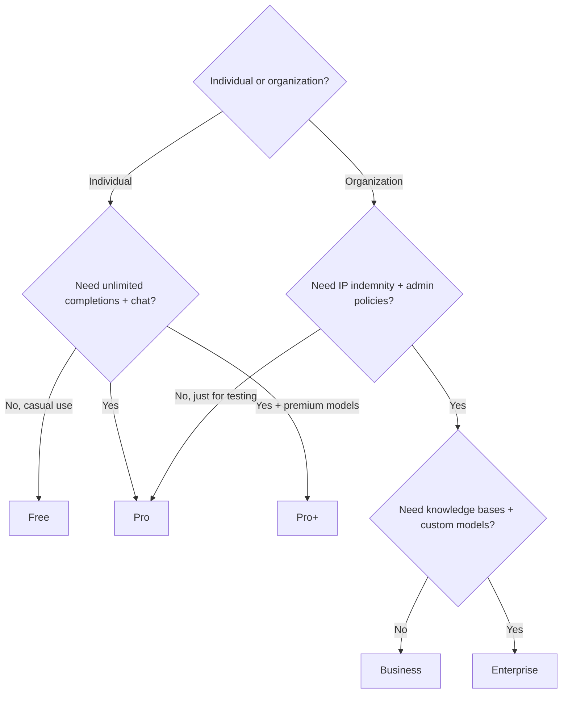

# GH-300 Master Index - GitHub Copilot

> **GH-300: GitHub Copilot** certification (GitHub Certifications). One-stop visual guide. Concept-only - no exam questions reproduced.

## Skills measured (official weights)

| # | Domain | Weight |
|---|---|---|
| 1 | Responsible AI | 7% |
| 2 | Plans and features of GitHub Copilot | 30% |
| 3 | How GitHub Copilot works and how to manage it | 15% |
| 4 | Prompt crafting and prompt engineering | 15% |
| 5 | Developer use cases for AI | 13% |
| 6 | Testing with GitHub Copilot | 13% |
| 7 | Privacy fundamentals and context exclusions | 7% |

## Plan comparison cheat

| Feature | Free | Pro | Pro+ | Business | Enterprise |
|---|---|---|---|---|---|
| Code completions | 2,000/mo | Unlimited | Unlimited | Unlimited | Unlimited |
| Chat messages | 50/mo | Unlimited | Unlimited | Unlimited | Unlimited |
| Models available | Limited | All standard | All + premium | All standard | All + custom |
| IP indemnity | No | No | No | Yes | Yes |
| Content exclusions | No | No | No | Yes | Yes |
| Audit logs | No | No | No | Yes | Yes |
| SSO / SCIM | No | No | No | Yes | Yes |
| Knowledge bases (Copilot Enterprise) | No | No | No | No | Yes |
| Custom models / fine-tuning | No | No | No | No | Yes |

## Question-pattern translator

| Wording | Likely answer |
|---|---|
| "data not used to train..." | **Business / Enterprise** with content exclusions |
| "find IP-indemnified plan" | **Business** or **Enterprise** |
| "block matches against public code" | **Public code filter ON** |
| "centralized policy + audit logs" | **Business / Enterprise** |
| "open natural-language chat in IDE" | **Copilot Chat** |
| "edit multiple files at once" | **Copilot Edits** |
| "long-running task that explores codebase" | **Copilot Workspace / Agents** |
| "PR summary auto-generated" | **Copilot pull request summaries** |
| "block confidential paths from being sent" | **Content exclusions** (Business/Enterprise) |
| "policy: turn off public code matching" | **Public code filter** policy |

## Decision tree - which plan?

## Service-to-feature map

| Surface | What it does |
|---|---|
| **Code completions** | Inline grey ghost-text suggestions based on cursor + nearby code |
| **Copilot Chat** | Side panel or inline chat conversational with code awareness |
| **Copilot Edits** | Multi-file inline edits driven by natural-language goals |
| **Copilot Workspace** | Task-oriented experience: spec then plan then implementation then PR |
| **Copilot in CLI** | `gh copilot suggest` / `gh copilot explain` for shell commands |
| **PR summaries** | Auto-generated description from diff |
| **Knowledge bases** | Enterprise-only retrieval over private docs |
| **Custom models** | Enterprise-only fine-tune on private code |

## Top 12 gotchas

1. **Free plan has hard caps** (2k completions, 50 chat msgs / month).
2. **IP indemnity is Business / Enterprise only** - Pro / Pro+ do not include it.
3. **Content exclusions are Business / Enterprise only** - set at org / repo path level.
4. **Public code filter** blocks suggestions that match public code on GitHub. Off by default in personal plans.
5. **Telemetry**: Copilot may send code snippets unless you opt out (and even with opt-out, Business/Enterprise users get separate data-handling).
6. **Copilot Chat does not learn from your prompts** - no per-user fine-tuning.
7. **Context window is finite** - far-away files won't be considered automatically; reference them with `#file:` (VS Code) or `@workspace` (JetBrains) explicitly.
8. **Knowledge bases require Enterprise** - not available in Business.
9. **`@workspace` in Chat** uses semantic search across the workspace; `#file:` is direct file include.
10. **Copilot Edits** needs the file open or referenced; it won't randomly mutate untouched files.
11. **Audit logs** for Copilot only exist in Business / Enterprise.
12. **GitHub Mobile + JetBrains + Visual Studio + VS Code + Neovim + Xcode + Eclipse** - verify which IDEs are supported on the exam.

## Supporting pages

| Page | Link |
|---|---|
| Cheatsheet | [05-exam-cheatsheet.md](05-exam-cheatsheet.md) |
| References | [06-references.md](06-references.md) |
| Extra concepts | [07-extra-gh300-concepts.md](07-extra-gh300-concepts.md) |
| Learn summaries | [08-learn-summaries.md](08-learn-summaries.md) |
| Architectures | [09-arch-gh300.md](09-arch-gh300.md) |
| Microsoft resources | [11-microsoft-resources.md](11-microsoft-resources.md) |
| Glossary | [12-glossary.md](12-glossary.md) |
| Flashcards | [13-flashcards.md](13-flashcards.md) |
| Pitfalls | [14-pitfalls.md](14-pitfalls.md) |
| Hands-on labs | [15-hands-on-labs.md](15-hands-on-labs.md) |
| Architecture center | [16-architecture-center.md](16-architecture-center.md) |
| AI Copilot Quiz | [17-copilot-quiz.md](17-copilot-quiz.md) |
| Practice assessment | [99-practice-assessment.md](99-practice-assessment.md) |
| Video tutorials | [99-video-tutorials.md](99-video-tutorials.md) |

---

[Domain 1: Responsible AI](01-responsible-ai.md)
