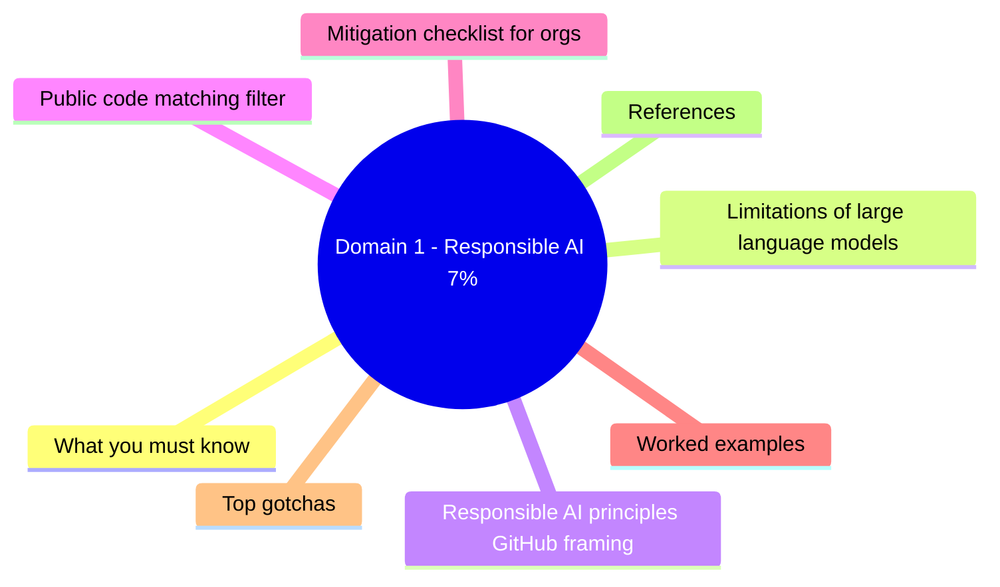
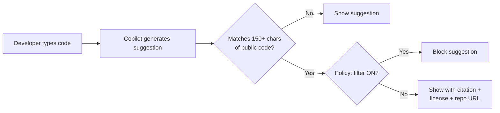

# Domain 1 - Responsible AI (7%)

> Risks, limitations, and mitigations specific to AI coding assistants.

## Domain mind map

## What you must know

- **Limitations of AI coding assistants** - hallucinated APIs, outdated patterns, security vulnerabilities, license-incompatible matches.
- **Bias and fairness** - training data skew toward popular languages / frameworks / patterns; under-representation of niche stacks.
- **Hallucination** - confident output that is factually wrong (non-existent functions, wrong signatures).
- **Mitigations** built into Copilot:
  - **Public code matching filter** (block suggestions of approximately 150+ chars matching public code).
  - **Toxicity / hate speech filters** in Chat.
  - **Vulnerability filter** (basic SAST-style checks before output).
  - **Reference output** (citation when matching public code is allowed through).
- **User responsibility**:
  - Review all suggestions before accepting.
  - Run tests + linters + security scans.
  - Verify licenses on suggested snippets.
  - Don't paste secrets / PII into prompts.

## Limitations of large language models

| Risk | Example | Mitigation |
|---|---|---|
| **Hallucinated API** | `requests.fetch_async()` does not exist | Run / test / read docs |
| **Outdated pattern** | `componentWillMount` lifecycle | Pin Copilot to latest model; review |
| **Security flaw** | SQL string concat instead of parameterized | Run SAST (CodeQL, Snyk); manual review |
| **License risk** | Long verbatim match to GPL repo | Enable **public code filter** |
| **Bias** | Suggests `male`/`female` enum without inclusive options | Manual review; cultural awareness |
| **Privacy leak** | Echoes earlier prompt content in shared context | Use **content exclusions** (Bus./Ent.) |

## Responsible AI principles (GitHub framing)

1. **Accountability** - humans are responsible for what they ship; Copilot is an assistant.
2. **Fairness** - strive to give comparable quality across languages and frameworks.
3. **Transparency** - show citations when suggestions match public code.
4. **Privacy** - minimize data collection; Business / Enterprise default to no training on prompts.
5. **Security** - built-in vulnerability filters; keep secrets out of prompts.
6. **Reliability** - model improvements + filter improvements over time.

## Public code matching filter

Settings location:
- Personal: github.com then Settings then Copilot then Suggestions matching public code.
- Org / Enterprise: Org settings then Copilot then Policies.

## Mitigation checklist for orgs

- [ ] Enable **public code filter** at org policy level.
- [ ] Enable **content exclusions** for sensitive paths (Business / Enterprise).
- [ ] Run **CodeQL** or equivalent SAST in CI.
- [ ] Train developers on prompt hygiene (no secrets, no PII).
- [ ] Use **audit logs** to monitor Copilot usage.
- [ ] Keep a list of approved + banned use cases.

## Worked examples

- **Hospital records app**: Sensitive PHI in code comments. Enable content exclusions on `/medical/` path; ban Copilot Chat in that workspace.
- **Open-source library**: Want maximum compatibility. Enable public code filter to avoid GPL-tainted suggestions.
- **Internal tooling**: Latency-critical path with novel algo. Manually review every Copilot suggestion; AI assistance is supplementary, not authoritative.

## Top gotchas

1. **Public code filter is off by default** in personal plans.
2. **Vulnerability filter is not a substitute for SAST**. Always run dedicated security scans.
3. **License compliance is the user's responsibility** even with the filter on.
4. **Hallucinated API names** are common - always check `pip` / `npm` / docs.
5. **Bias in suggestions** is a real risk; especially in HR / legal / medical code paths.

## References

- [Responsible use of GitHub Copilot](https://docs.github.com/copilot/responsible-use-of-github-copilot-features/responsible-use-of-github-copilot-chat-in-your-ide)
- [GitHub trust center](https://github.com/trust)

---

[Master Index](00-MASTER-INDEX.md) - [Domain 2: Plans and Features](02-plans-features.md)
