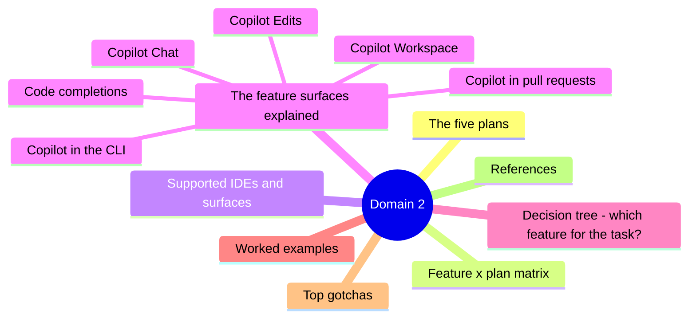
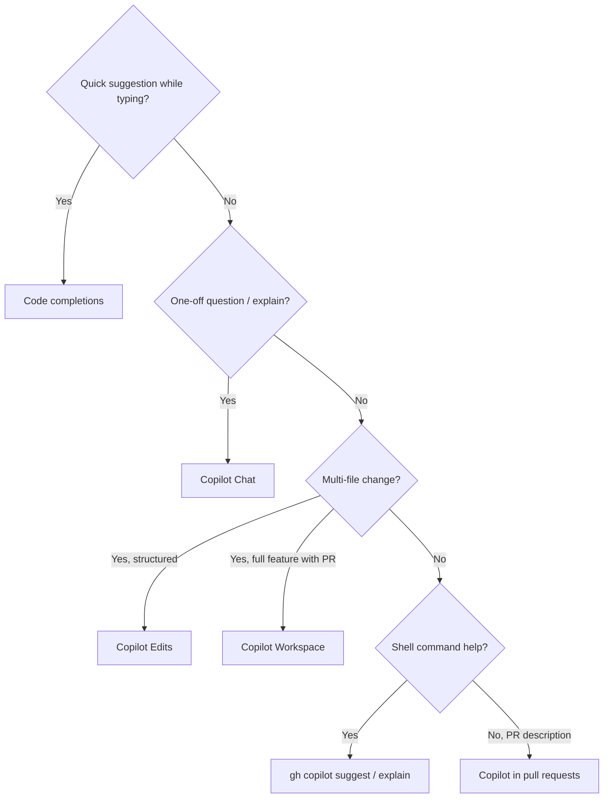

# Domain 2 - Plans and Features of GitHub Copilot (30%)

> Largest exam domain. Memorize plan tiers + feature availability + IDE support.

## Domain mind map

## The five plans

| Plan | Audience | Pricing model |
|---|---|---|
| **Copilot Free** | Anyone with a GitHub account | Free; capped (2k completions, 50 chat msgs / month) |
| **Copilot Pro** | Individual developers | Per-user / month; verified students + maintainers free |
| **Copilot Pro+** | Power users | Per-user / month; includes premium models |
| **Copilot Business** | Teams / SMB | Per-seat / month; org admin controls + IP indemnity |
| **Copilot Enterprise** | Large orgs | Per-seat / month; everything in Business + knowledge bases + custom models |

## Feature x plan matrix

| Feature | Free | Pro | Pro+ | Business | Enterprise |
|---|---|---|---|---|---|
| Code completions | 2,000/mo | Yes | Yes | Yes | Yes |
| Copilot Chat | 50/mo | Yes | Yes | Yes | Yes |
| Copilot Edits / Multi-file | Limited | Yes | Yes | Yes | Yes |
| Copilot in CLI | Yes | Yes | Yes | Yes | Yes |
| Copilot in PRs (summaries) | No | Yes | Yes | Yes | Yes |
| Premium models (Claude Opus, GPT-4.5, etc.) | No | Limited | Yes | Limited | Yes |
| IP indemnity | No | No | No | Yes | Yes |
| Content exclusions | No | No | No | Yes | Yes |
| Org policy controls | No | No | No | Yes | Yes |
| SSO / SAML / SCIM | No | No | No | Yes | Yes |
| Audit logs | No | No | No | Yes | Yes |
| Knowledge bases | No | No | No | No | Yes |
| Custom models / fine-tuning | No | No | No | No | Yes |
| Documentation grounding (Copilot Spaces) | No | No | No | Limited | Yes |

## Supported IDEs and surfaces

| Surface | Completions | Chat | Edits |
|---|---|---|---|
| **VS Code** | Yes | Yes | Yes |
| **Visual Studio** | Yes | Yes | Yes |
| **JetBrains (IntelliJ, PyCharm, ...)** | Yes | Yes | Limited |
| **Neovim** | Yes | Limited | No |
| **Xcode** | Yes | Yes | No |
| **Eclipse** | Yes | Limited | No |
| **Azure Data Studio** | Yes | Yes | No |
| **GitHub.com (web)** | Yes (Spaces) | Yes | No |
| **GitHub Mobile** | No | Yes | No |
| **CLI (`gh copilot`)** | n/a | Yes | n/a |

## The feature surfaces explained

### Code completions
Inline ghost-text suggestions as you type. `Tab` accepts. `Esc` rejects. `Alt + ]` cycles next suggestion. Powered by a fast, low-latency model.

### Copilot Chat
- **Inline chat** (`Ctrl/Cmd + I`) - quick edits in the editor.
- **Chat panel** (`Ctrl/Cmd + Shift + I`) - side panel for conversational interaction with code context.
- **Slash commands**: `/explain`, `/fix`, `/tests`, `/doc`, `/optimize`, `/clear`, `/help`, `/new`.
- **Context references**: `#file:foo.ts`, `#selection`, `@workspace`, `@terminal`, `@vscode`.

### Copilot Edits
Multi-file natural-language driven edits. You add files to the working set; Copilot proposes a diff across all of them; you accept or reject per file. Powered by a stronger model; slower than completions.

### Copilot Workspace
Task-oriented mode: describe a feature/issue, Copilot proposes a **spec** then **plan** then **implementation** across files, then opens a draft PR. Currently web-based, available on GitHub.com for Enterprise users.

### Copilot in pull requests
- Auto-generated **PR summaries** from diff.
- **PR description regeneration** on demand.
- **Code review** suggestions via `gh copilot review` (preview).

### Copilot in the CLI
`gh copilot suggest "delete all .DS_Store files recursively"` suggests command + explanation + alternatives. `gh copilot explain "find . -type f -mtime +30 -delete"` gives a plain-English explanation of an opaque command.

### Knowledge bases (Enterprise)
Curate Markdown / docs / wikis into a knowledge base. Chat queries can `@workspace` against that knowledge base for grounded answers.

### Custom models (Enterprise)
Fine-tune Copilot on your private codebase to match house conventions. Limited preview; gated.

## Decision tree - which feature for the task?

## Worked examples

- **Solo dev on personal projects**: **Pro** (unlimited completions + chat). Verified student gets free Pro.
- **5-person SaaS startup with sensitive customer code**: **Business** (IP indemnity + content exclusions + audit logs).
- **F500 enterprise with internal docs to ground Copilot**: **Enterprise** (knowledge bases + custom models).
- **Open source maintainer wanting public code filter ON globally**: **Pro** (free for verified maintainers) + filter ON.

## Top gotchas

1. **Free plan is capped** - 2k completions and 50 chat messages per month.
2. **Pro and Pro+ do NOT include IP indemnity**.
3. **Content exclusions are Business / Enterprise only** - set at org or repo path level.
4. **Knowledge bases require Enterprise**; Business does not have them.
5. **Custom / fine-tuned models require Enterprise** (limited preview).
6. **Verified students and maintainers** get Pro free.
7. **Org admins control plan policies**: model selection, public code filter, content exclusions.
8. **Some features (Workspace, Spaces) are web-only**; not in IDE.

## References

- [About plans for GitHub Copilot](https://docs.github.com/copilot/about-github-copilot/plans-for-github-copilot)
- [About GitHub Copilot Business](https://docs.github.com/copilot/copilot-business)
- [About GitHub Copilot Enterprise](https://docs.github.com/copilot/copilot-enterprise)

---

[Domain 1](01-responsible-ai.md) - [Domain 3: How It Works](03-how-it-works.md)
