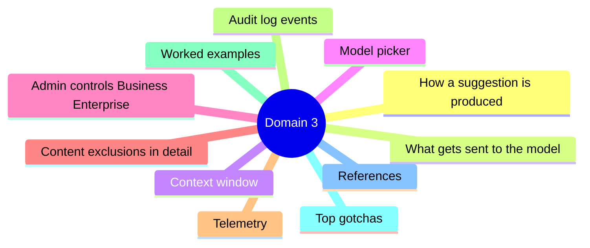
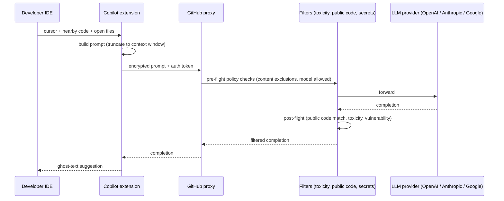
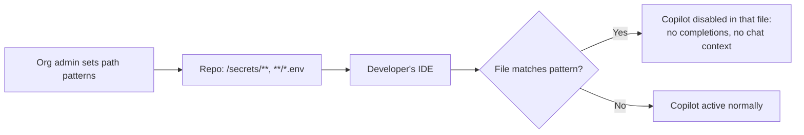

# Domain 3 - How GitHub Copilot Works and How to Manage It (15%)

> Architecture under the hood + admin controls.

## Domain mind map

## How a suggestion is produced

## What gets sent to the model

For **completions**:
- Code in the current file before + after the cursor (truncated).
- Code in **nearby open tabs** (recently used).
- Filename + language.
- A few hundred tokens of "system" framing.

For **Chat**:
- The chat history (this conversation).
- The currently selected text or the active file (if `#selection` / `#file` referenced).
- Workspace search results when `@workspace` is used.
- Terminal output when `@terminal` is referenced.

**Not sent:**
- Files not open in the IDE (unless explicitly referenced).
- Files matching content exclusion patterns (Business / Enterprise).
- Files in `.gitignore` *are* sent - that does not block Copilot. Use **content exclusions** for true blocklisting.

## Context window

| Surface | Approx context tokens |
|---|---|
| Code completions | ~8,000 |
| Chat | ~16,000 to 128,000 (model-dependent) |
| Edits | ~32,000 to 128,000 |
| Workspace | ~128,000 |

Bigger context window means better long-range awareness but slower and costlier per response.

## Model picker

- Personal users (Pro / Pro+): can pick from a list of models in Chat (GPT-4o, Claude 3.5 Sonnet, Gemini, o-series, etc.).
- Org users (Business / Enterprise): admin policy chooses which models are allowed.
- Default model is curated by GitHub for each surface (completions vs chat vs edits).

## Admin controls (Business / Enterprise)

| Control | Where | Effect |
|---|---|---|
| **Allow / block plan members** | Org then Copilot then Access | Per-user seat assignment |
| **Public code filter** | Org then Copilot then Policies | Block suggestions matching public code |
| **Content exclusions** | Org / Repo then Copilot then Content exclusions | Stop Copilot reading specific paths |
| **Allow / block models** | Enterprise then Policies | Restrict which LLMs can be used |
| **Chat in IDE / GitHub.com** | Org then Copilot then Policies | Toggle chat surfaces |
| **Suggestions matching public code** | Org then Copilot then Policies | Allow / Block / Allow with citation |
| **Audit logs** | Enterprise then Audit log | Track Copilot events (`copilot.*`) |
| **Telemetry / data sharing** | Org then Copilot then Privacy | Opt out of model training (Business default) |

## Content exclusions in detail

- Patterns use `.gitignore`-style globs.
- Apply at **repo** or **org** level.
- Trigger UI indicator in IDE that Copilot is disabled here.
- **Not retroactive** - existing chat history elsewhere is unchanged.

## Telemetry

| Plan | Default for "use code as training data" |
|---|---|
| Free / Pro / Pro+ | **Opt-in by default** (you can opt out) |
| Business / Enterprise | **Opt-out by default** (data is not used to train) |

GitHub may collect:
- Suggestion shown / accepted / rejected events.
- Latency metrics.
- Error reports.
- (If opted in) anonymized code snippets.

## Audit log events

| Event | Fires when |
|---|---|
| `copilot.policy_create` | Admin creates a policy |
| `copilot.cfb_seat_assigned` | User assigned a seat |
| `copilot.cfb_seat_cancelled` | Seat removed |
| `copilot.content_exclusion_modify` | Content exclusion changed |
| `copilot.cfi_purchase` | Plan purchased |

## Worked examples

- **Block Copilot in `secrets/` and `*.env`**: Org admin then Copilot then Content exclusions then add patterns. IDE shows blocked indicator on those files.
- **Force teams to use only Claude**: Enterprise admin then Models policy then Allow only Anthropic Claude.
- **Investigate "who turned off the public code filter?"**: Audit log filter `action:copilot.policy_create` then review actor.

## Top gotchas

1. **`.gitignore` does NOT block Copilot** - use content exclusions.
2. **Personal plans default to OPT-IN for training**; flip in settings.
3. **Business / Enterprise plans default to OPT-OUT** for training.
4. **Model picker availability depends on policy** - admins can restrict.
5. **Content exclusions take effect after a Copilot client refresh** (re-open IDE if needed).
6. **`@workspace` semantic search** is local; the embeddings are computed in IDE for VS Code.
7. **Audit logs are Enterprise-grade only** - Business has limited audit visibility.

## References

- [How GitHub Copilot improves over time](https://docs.github.com/copilot/responsible-use-of-github-copilot-features)
- [Configuring content exclusions](https://docs.github.com/copilot/managing-copilot/configuring-and-auditing-content-exclusion)
- [Managing policies for GitHub Copilot in your organization](https://docs.github.com/copilot/managing-copilot/managing-policies-and-features-for-copilot-in-your-organization)
- [Audit log events for Copilot](https://docs.github.com/copilot/managing-copilot/reviewing-audit-logs-for-github-copilot-business)

---

[Domain 2](02-plans-features.md) - [Domain 4: Prompt Crafting](04-prompt-crafting.md)
