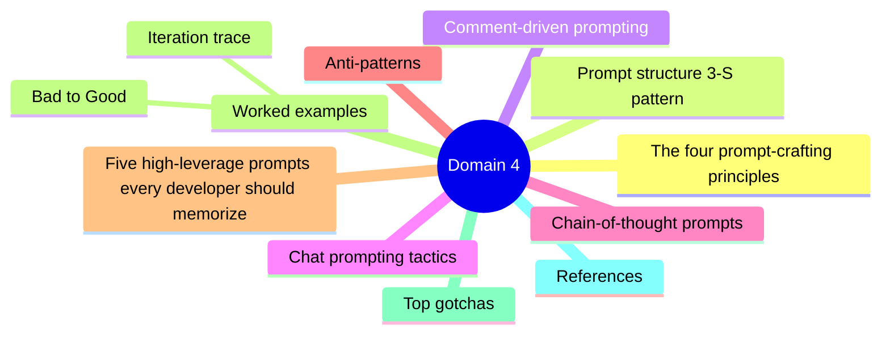

# Domain 4 - Prompt Crafting and Prompt Engineering (15%)

> The skill that separates "Copilot-frustrated" from "Copilot-superpowered" developers.


## Domain mind map



## The four prompt-crafting principles

1. **Be specific** - "write a function" is bad. "Write a Python function `parse_iso_date(s: str) -> datetime` that handles UTC offsets and raises ValueError on malformed input" is good.
2. **Provide context** - open the related files; reference `#file:` or `@workspace`; paste type definitions; mention the framework version.
3. **Show examples** - input then expected output pairs in a comment let Copilot infer pattern.
4. **Iterate** - first suggestion is rarely perfect. Refine the prompt, accept partial, edit, ask again.

## Prompt structure (3-S pattern)

| Part | Purpose | Example |
|---|---|---|
| **Setup** | Context: framework, version, file purpose | `// React 18, TypeScript, this file is the AuthProvider` |
| **Specifics** | Concrete requirement | `// Implement useAuth() that returns user, signIn, signOut` |
| **Strict-output** | Format / style constraints | `// Use existing useReducer pattern from useCart` |

## Comment-driven prompting

In **completions**, Copilot reads the file. Place an intent-revealing comment + signature, and Copilot fills the body:

```python
# Convert a list of integers to a comma-separated string,
# rounding floats to 2 decimal places, skipping None entries.
def format_numbers(items: list) -> str:
    # cursor here
```

Tactics:
- Put the function signature on the same line below the comment.
- Reference type definitions earlier in the file.
- Use docstring / JSDoc with example inputs.

## Chat prompting tactics

| Tactic | Example |
|---|---|
| **Slash command** | `/explain` on selection |
| **Workspace search** | `@workspace where do we handle stripe webhooks?` |
| **File reference** | `#file:billing.ts add a refund() function` |
| **Selection scope** | `#selection refactor to async/await` |
| **Iterative refine** | "Now add error handling for 429s" |
| **Format constraint** | "Output a JSON schema only, no prose" |
| **Persona priming** | "Acting as a senior security engineer, review this for OWASP Top 10" |
| **Few-shot** | "Given these 3 examples, generate 10 more" |

## Chain-of-thought prompts

Break complex asks into ordered subtasks:

```
1. Read the existing handler in #file:server.ts
2. Identify which env vars it uses
3. Generate a `.env.example` with placeholders + comments
4. Update README to document each variable
```

Copilot Edits handles multi-step asks like this in one go (Business / Enterprise).

## Anti-patterns

| Anti-pattern | Fix |
|---|---|
| "Make it better" | Specify what kind of better: faster, shorter, more readable |
| "Fix the bug" without test | Provide a failing test case or stack trace |
| Asking from blank workspace | Open the files Copilot needs; use `#file:` |
| Re-asking same prompt | Iterate prompt; don't expect different answer |
| Ignoring filename / language | Filename + extension are part of context |
| Pasting secrets | Don't. Mask or use `<API_KEY>` placeholder |
| Vague refactor | Specify before/after pattern explicitly |

## Five high-leverage prompts every developer should memorize

1. **Generate tests** - `/tests` on a function generates unit tests with edge cases.
2. **Explain code** - `/explain` summarizes selected code in plain English.
3. **Fix this** - `/fix` proposes a fix when there's an error / lint warning.
4. **Document** - `/doc` generates docstrings / JSDoc.
5. **Optimize** - `/optimize` proposes performance or readability improvements.

## Worked examples

### Bad to Good

**Bad:** `write authentication`

**Good:**
> `// FastAPI app, JWT-based auth using PyJWT. Implement a function`
> `// authenticate(token: str) -> dict that validates a JWT signed with`
> `// HS256 using SECRET_KEY env var. Raise HTTPException(401) on invalid token.`
> `// Return the decoded payload on success.`
> `def authenticate(token: str) -> dict:`

### Iteration trace

1. Prompt: "Write a function to parse CSV"
2. Copilot generates a basic `csv.reader` wrapper.
3. Prompt: "Now make it handle quoted fields with commas"
4. Copilot adjusts.
5. Prompt: "Add type hints + a unit test"
6. Copilot extends.

## Top gotchas

1. **Open relevant files BEFORE prompting** - Copilot uses open tabs as context.
2. **Filename matters** - `helpers.spec.ts` vs `helpers.ts` shapes the suggestion.
3. **Don't fight the model** - if Copilot keeps doing X, restructure the prompt rather than retrying.
4. **`@workspace` is for semantic search** across files; `#file:` is for explicit include.
5. **Cursor position matters** - completions infer intent from where you stopped typing.
6. **Comment style is part of the prompt** - TODO comments, JSDoc, etc.

## References

- [Prompt engineering for GitHub Copilot Chat](https://docs.github.com/copilot/using-github-copilot/prompt-engineering-for-github-copilot)
- [Best practices for using Copilot](https://docs.github.com/copilot/using-github-copilot/best-practices-for-using-github-copilot)
- [GitHub Copilot Chat cheat sheet](https://docs.github.com/copilot/copilot-chat-cookbook)

---

[Domain 3](03-how-it-works.md) - [Domain 5: Developer Use Cases](05-developer-use-cases.md)
