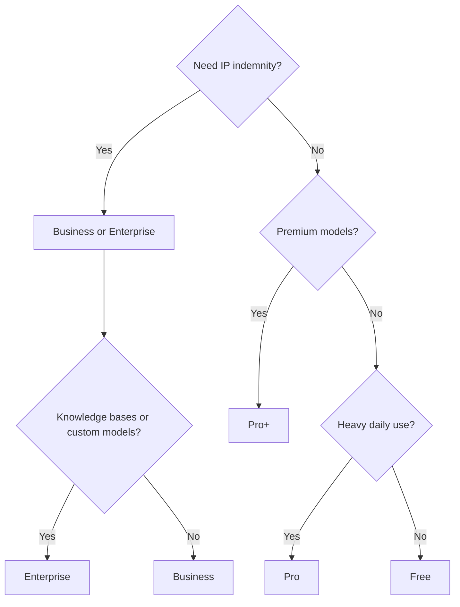

# GH-300 Exam Cheatsheet

> Print-friendly. The 60-second reset before exam time.

## Plans at a glance

| Plan | IP indemnity | Content exclusions | Knowledge bases | Custom models | Audit logs |
|---|---|---|---|---|---|
| Free | No | No | No | No | No |
| Pro | No | No | No | No | No |
| Pro+ | No | No | No | No | No |
| Business | YES | YES | No | No | YES |
| Enterprise | YES | YES | YES | YES | YES |

## Free plan caps

- **2,000 code completions / month**
- **50 chat messages / month**
- Limited model selection.

## Feature picker

| Need | Use |
|---|---|
| Inline code suggestions | Code completions |
| Conversational with code | Copilot Chat |
| Multi-file edits | Copilot Edits |
| Spec then plan then PR | Copilot Workspace (Enterprise web) |
| Shell command help | `gh copilot` CLI |
| Auto PR description | Copilot for pull requests |
| Ground answers in docs | Knowledge bases (Enterprise) |
| Match house style | Custom models (Enterprise) |

## Slash commands

| Command | Effect |
|---|---|
| `/explain` | Explain selected code |
| `/fix` | Propose a fix |
| `/tests` | Generate unit tests |
| `/doc` | Generate docstrings |
| `/optimize` | Suggest improvements |
| `/clear` | Clear chat |
| `/help` | List commands |
| `/new` | Scaffold new project / file |

## Context references in Chat

| Reference | Meaning |
|---|---|
| `#file:foo.ts` | Include this file |
| `#selection` | Include current selection |
| `@workspace` | Semantic search across workspace |
| `@terminal` | Include terminal output |
| `@vscode` | Ask about VS Code features |
| `@github` | Search across GitHub |

## Public code filter behavior

| Mode | Effect |
|---|---|
| Block | Suggestions matching ~150+ chars of public code are suppressed |
| Allow | Suggestions shown with no filter |
| Allow with citation | Match shown + repo URL + license |

## Content exclusions

- Glob patterns: `secrets/**`, `**/*.env`, `proprietary/**`.
- Org or repo level (Business / Enterprise).
- Blocks completions + chat context for matching files.
- `.gitignore` does NOT block Copilot - use exclusions.

## Privacy defaults

| Plan | Code as training data |
|---|---|
| Free / Pro / Pro+ | Opt-IN by default |
| Business / Enterprise | Opt-OUT by default |

## Question-pattern translator

| Wording | Answer |
|---|---|
| "block confidential paths" | Content exclusions |
| "data not used to train" | Business / Enterprise |
| "IP indemnity" | Business / Enterprise |
| "audit Copilot usage" | Business / Enterprise audit logs |
| "blocked suggestions matching public code" | Public code filter ON |
| "ground answers in our docs" | Knowledge bases (Enterprise) |
| "fine-tune on our private code" | Custom models (Enterprise) |
| "edit several files at once" | Copilot Edits |
| "free for verified students" | Pro |
| "PR description from diff" | Copilot for pull requests |

## Decision tree (final reset)

## 60-second reset

1. **30%** of exam = Plans + Features. Memorize the matrix.
2. **15%** = How it works (architecture, content exclusions, audit).
3. **15%** = Prompt crafting (specificity, context, examples, iteration).
4. **13%** + **13%** = Use cases + Testing.
5. **7%** + **7%** = Responsible AI + Privacy.
6. Default-off filters: public-code-match (personal). Default-OPT-IN training (personal).
7. Business / Enterprise = IP indemnity + content exclusions + audit logs.
8. Enterprise only = knowledge bases + custom models + Spaces (web).

---

[Master Index](00-MASTER-INDEX.md)
