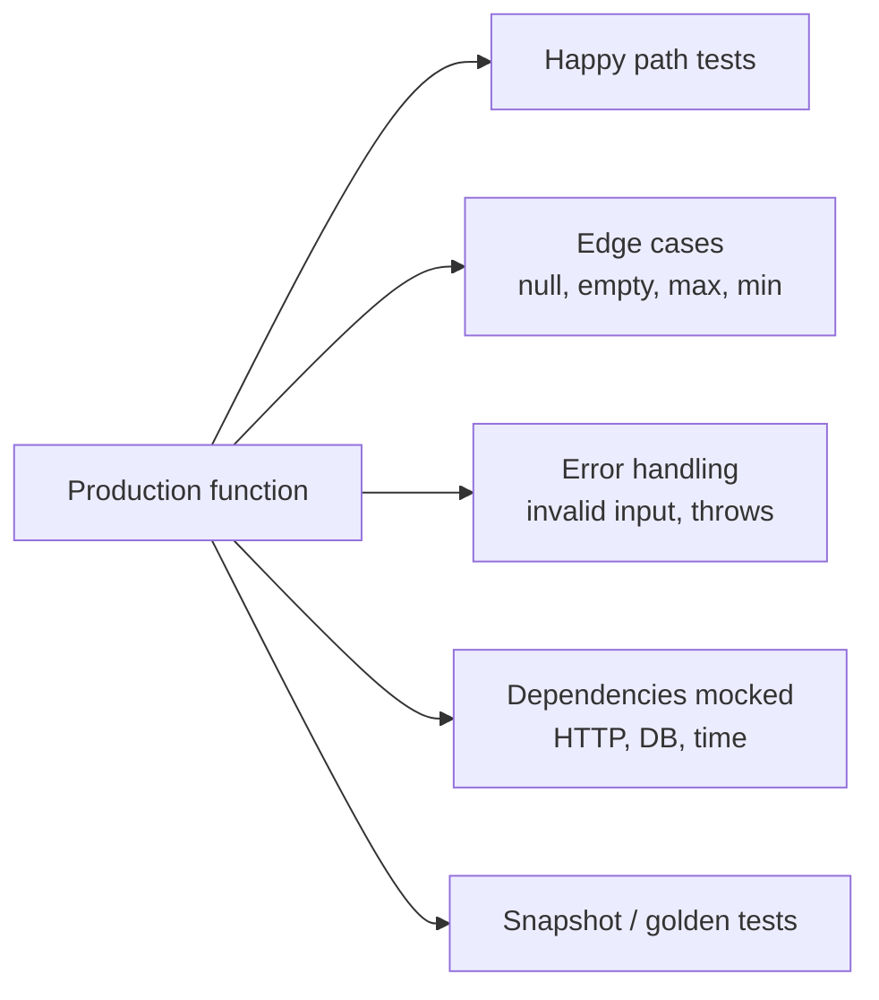
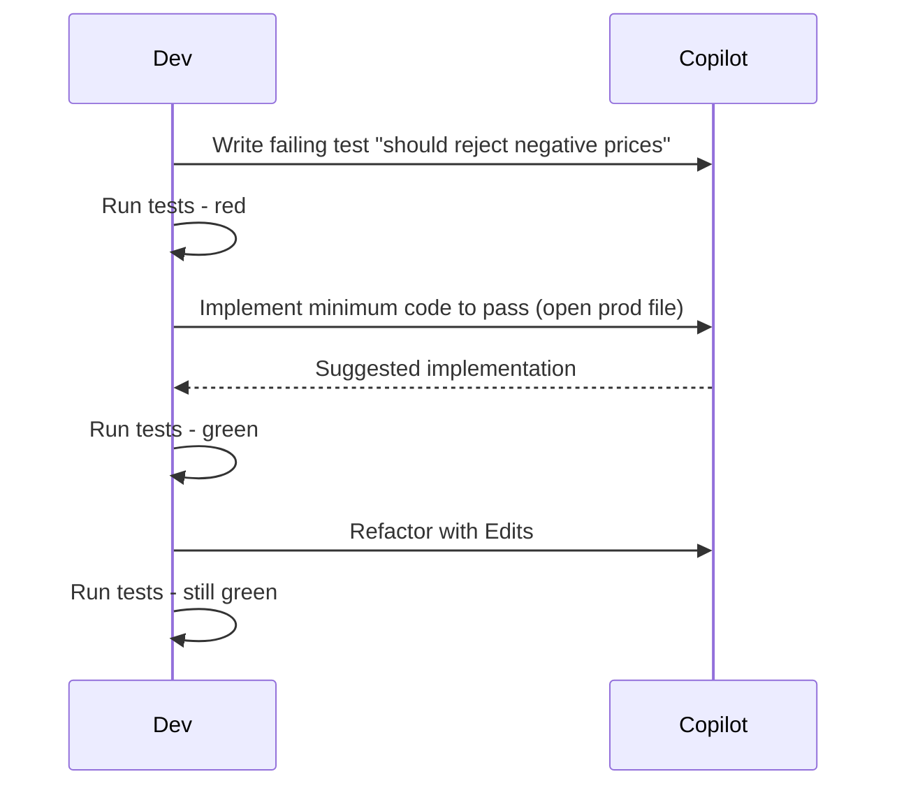

# Domain 6 - Testing with GitHub Copilot (13%)

> Generate, expand, and reason about tests using Copilot.

## The four testing-with-Copilot patterns

1. **Scaffold from function** - `/tests` on a selected function.
2. **Add edge cases** - "Add tests for null, empty, large input".
3. **Generate from spec** - "Generate tests for this OpenAPI spec".
4. **TDD with Copilot** - write the test first; Copilot fills in the implementation.

## Slash commands for tests

| Command | What it does |
|---|---|
| `/tests` | Generate a test file for the selected function |
| `/fix` | Patch a failing test to make it pass (use carefully - may mask bugs) |
| `/explain` | Walk through what a test asserts |
| `/doc` | Add JSDoc / docstring to a test for clarity |

## Coverage strategies



Ask Copilot specifically for each layer:
- "Generate happy-path tests for `parseDate`"
- "Now add edge cases: empty string, null, leap year, year 9999"
- "Now add error tests: invalid format, non-string input"
- "Mock the system clock for deterministic results"

## Frameworks Copilot handles well

| Language | Popular frameworks |
|---|---|
| JavaScript / TypeScript | Jest, Vitest, Mocha, Playwright |
| Python | pytest, unittest, hypothesis (property-based) |
| Java | JUnit 5, Mockito, AssertJ |
| C# / .NET | xUnit, NUnit, Moq, FluentAssertions |
| Go | `testing` stdlib, testify |
| Ruby | RSpec, Minitest |

Copilot infers the framework from existing test files in the repo. Open one before prompting.

## TDD workflow with Copilot



## Mocking patterns

- **HTTP**: "Mock the `fetch` call returning a 200 with this JSON..."
- **Database**: "Use an in-memory SQLite for the test setup"
- **Time**: "Mock `Date.now` to return 2024-01-01"
- **Random**: "Seed the RNG with a fixed value"
- **File system**: "Use `memfs` instead of real disk"

## Property-based testing

`@workspace generate hypothesis tests for parse_iso_date that assert round-trip property: parse(format(d)) == d for any datetime d`.

## Limitations + gotchas

1. **Generated tests may be tautological** - they verify that the implementation does what the implementation does. You must add behavioral assertions.
2. **Edge cases need explicit prompting** - Copilot defaults to happy path.
3. **`/fix` may modify the test instead of the bug** - always inspect the diff.
4. **Mocked tests can hide real failures** - balance with integration tests.
5. **Coverage % is not quality** - Copilot can pad coverage with low-value tests.
6. **Flaky tests** - if Copilot writes a test that depends on order, time, or network, fix the determinism.
7. **Snapshots auto-pass on first run** - inspect the snapshot before committing.

## Worked examples

### Generating a test suite

```python
# parse_iso_date returns datetime in UTC; raises ValueError on bad input.
def parse_iso_date(s: str) -> datetime:
    ...

# Selected the function then /tests
# Copilot generates:
# - test_parses_basic_iso
# - test_handles_z_suffix_as_utc
# - test_handles_offset
# - test_raises_on_garbage
# - test_raises_on_empty
```

### Asking for edge cases

> "Now add tests for: very large dates (year 9999), very small (year 1), leap-second (23:59:60), and microsecond precision."

### TDD example

> Write a Vitest test for a function `slugify(s)` that lowercases, replaces non-alphanumerics with -, collapses repeated -, and trims leading/trailing -.

Copilot writes the test. Run it (red). Open `slugify.ts` and prompt "Implement slugify per the test in #file:slugify.test.ts". Copilot writes the implementation. Run (green). Done.

## References

- [Generating tests with GitHub Copilot](https://docs.github.com/copilot/copilot-chat-cookbook/testing-code)
- [Best practices for using Copilot to generate tests](https://docs.github.com/copilot/using-github-copilot/best-practices-for-using-github-copilot)

---

[Domain 5](05-developer-use-cases.md) - [Domain 7: Privacy](07-privacy-fundamentals.md)
