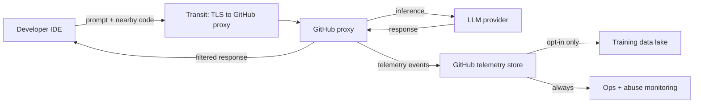
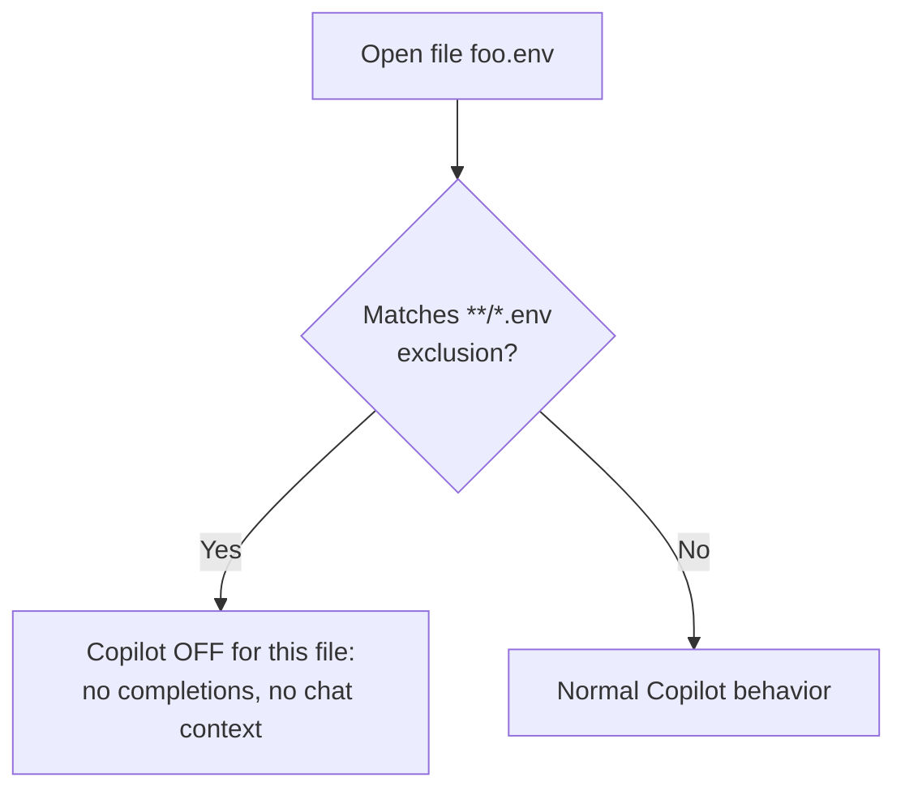

# Domain 7 - Privacy Fundamentals and Context Exclusions (7%)

> What data Copilot collects, where it goes, how to control it.

## Data lifecycle

## What is collected by default

| Plan | Code snippets sent for completion | Stored after response | Used for training |
|---|---|---|---|
| Free / Pro / Pro+ | Yes (transient) | Up to 28 days for abuse review | **Opt-in** by default |
| Business | Yes (transient) | Not stored beyond response | **Never** (default) |
| Enterprise | Yes (transient) | Not stored beyond response | **Never** (default) |

## Privacy controls (where to flip)

| Control | Personal | Business / Enterprise |
|---|---|---|
| Allow Copilot to use my code as training data | github.com / Settings / Copilot / Allow GitHub to use my code snippets... | Org admin policy (default OFF) |
| Public code matching filter | Personal Copilot settings (default OFF) | Org policy (recommended ON) |
| Content exclusions | Not available | Org / Repo level |
| Chat data retention | n/a | Org policy: 0 days available |

## Content exclusions

- Path-glob patterns at **org** or **repo** level.
- Block Copilot from reading matching files for completions and chat context.
- Examples: `secrets/**`, `**/*.pem`, `**/*.env`, `proprietary/**`.
- Scope: file-content reading. Copilot still works in OTHER files of the same project.
- IDE shows a status indicator that Copilot is disabled in the excluded file.

## What `.gitignore` does NOT do

- `.gitignore` controls **git tracking** only.
- Files in `.gitignore` are still readable by your IDE, and therefore by Copilot, unless excluded.
- To block Copilot, use **content exclusions** (Business / Enterprise only).

## Public code matching

- Filter checks whether the suggestion is a long verbatim match of any public code on GitHub.
- Default OFF for personal plans; recommended ON for orgs.
- When ON: matching suggestions are blocked.
- When "allow with citation": match is shown with origin URL + license tag.

## Telemetry vs training

| Data type | Always sent | Opt-out available |
|---|---|---|
| Latency / suggestion shown / accepted | Yes (anonymized) | Limited |
| Error reports | Yes | Yes |
| Code snippets | Only if you opt in (personal) or in Business default no | Yes (Business default OFF) |

## Compliance

- **GDPR / CCPA** - GitHub provides DPA + sub-processor list.
- **SOC 2 Type II** - Copilot for Business and Enterprise.
- **HIPAA** - **No BAA** for Copilot - do not paste PHI into Copilot prompts.
- **Export control** - check sanctioned jurisdictions before deploying.

## Worked examples

- **Bank engineering team** - enable content exclusions on `regulated/**`; require model policy = Business-approved only; audit log all events.
- **Open-source maintainer** - enable public code filter ON globally; opt out of training (personal); cite license-clean libraries only.
- **Healthcare ISV** - **do not put PHI in any Copilot prompt**; even with Business, GitHub does not sign a HIPAA BAA for Copilot at this time. Use content exclusions on `phi/**` and a separate non-Copilot workflow for protected data paths.

## Top gotchas

1. **Personal plans are opt-IN to training by default**. Flip the toggle to opt out.
2. **`.gitignore` does NOT block Copilot reads**. Use content exclusions.
3. **Content exclusions are Business / Enterprise only**. Personal plans cannot path-block.
4. **No HIPAA BAA for Copilot** - keep PHI out of prompts.
5. **Audit logs only on Business / Enterprise**. Personal plans have no admin visibility.
6. **Public code filter is OFF by default** in personal plans.
7. **Content exclusions need an IDE refresh** to apply.
8. **Telemetry is always collected** for ops; only training data is opt-out.

## References

- [About privacy for GitHub Copilot](https://docs.github.com/copilot/about-github-copilot/about-github-copilot-trust-and-privacy)
- [Configuring content exclusions for GitHub Copilot](https://docs.github.com/copilot/managing-copilot/configuring-and-auditing-content-exclusion)
- [GitHub Copilot privacy FAQs](https://github.com/features/copilot/security)

---

[Domain 6](06-testing-with-copilot.md) - [Master Index](00-MASTER-INDEX.md)
