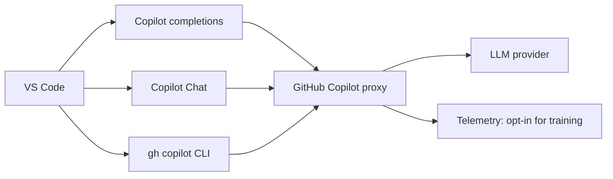
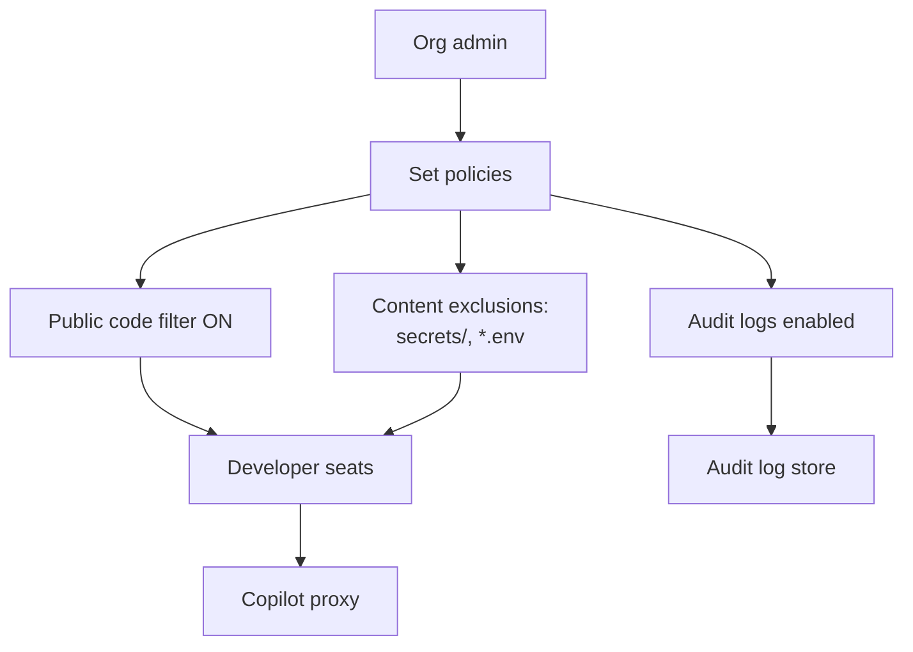
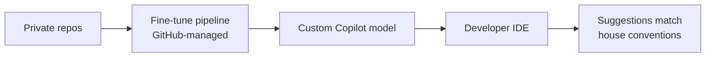
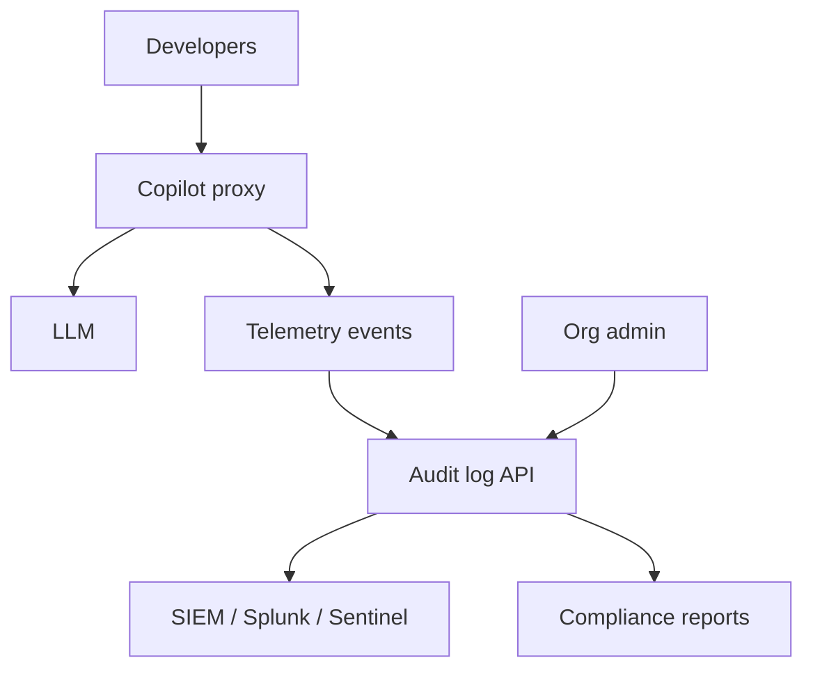
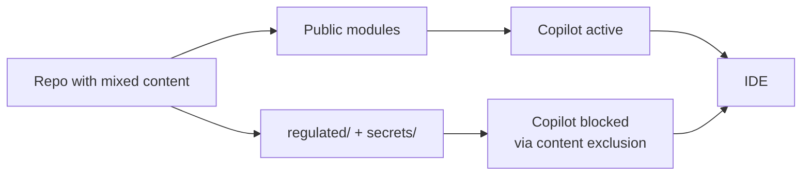

# GH-300 Architectures

> 6 reference scenarios for GitHub Copilot at scale.

## 1. Personal developer workflow



## 2. Small team on Copilot Business



## 3. Enterprise with knowledge bases

```mermaid
flowchart LR
    Docs[Curated docs repos]
    Docs --> Idx[Knowledge base index]
    Idx --> KB[Knowledge base]
    Dev[IDE / web Chat]
    Dev -->|@workspace q| Chat[Copilot Chat Enterprise]
    Chat --> KB
    KB --> Chat
    Chat --> Dev
```

## 4. Custom models pipeline (Enterprise preview)



## 5. Compliance + audit topology



## 6. Content exclusions + IP-sensitive workflow



---

[Master Index](00-MASTER-INDEX.md)
